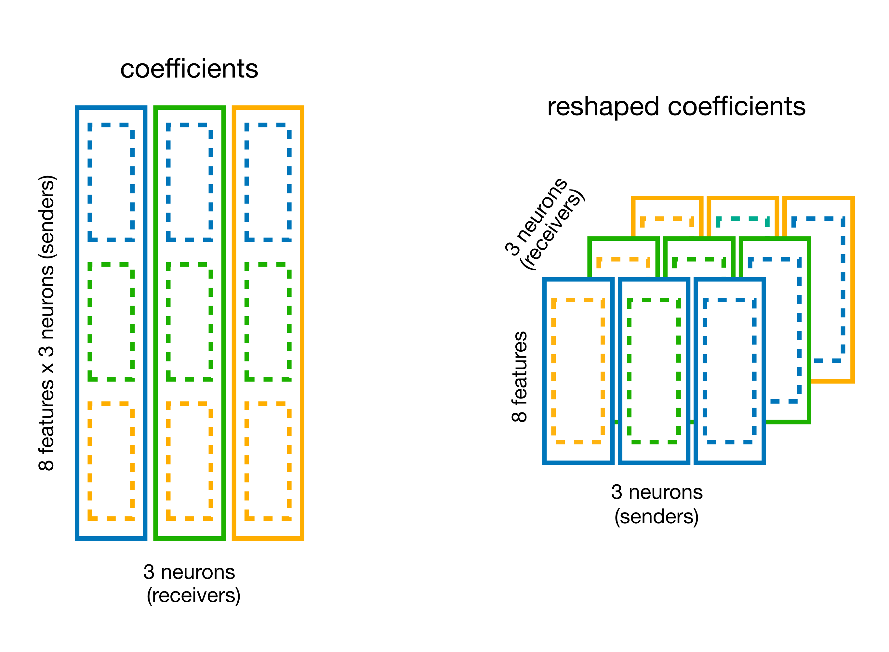

---
jupytext:
  text_representation:
    extension: .md
    format_name: myst
    format_version: 0.13
    jupytext_version: 1.16.6
kernelspec:
  display_name: Python 3 (ipykernel)
  language: python
  name: python3
---
```{code-cell} ipython3
:tags: [hide-input, render-all]

%matplotlib inline
import warnings

warnings.filterwarnings(
    "ignore",
    message="plotting functions contained within `_documentation_utils` are intended for nemos's documentation.",
    category=UserWarning,
)

warnings.filterwarnings(
    "ignore",
    message="Ignoring cached namespace 'core'",
    category=UserWarning,
)

warnings.filterwarnings(
    "ignore",
    message=(
        "invalid value encountered in div "
    ),
    category=RuntimeWarning,
)
```
:::{admonition} Download
:class: important render-all

This notebook can be downloaded as **{nb-download}`head_direction-presenters.ipynb`**. See the button at the top right to download as markdown or pdf.

:::
# Fit head-direction population
This notebook has had all its explanatory text removed and has not been run.
 It is intended to be downloaded and run locally (or on the provided binder)
 while listening to the presenter's explanation. In order to see the fully
 rendered of this notebook, go [here](../../full/day2/head_direction.md)
## Learning objectives
```{code-cell} ipython3
:tags: [render-all]

import matplotlib.pyplot as plt
import numpy as np
import pynapple as nap

import nemos as nmo

# some helper plotting functions
from nemos import _documentation_utils as doc_plots
import workshop_utils

# configure pynapple to ignore conversion warning
nap.nap_config.suppress_conversion_warnings = True

# configure plots some
plt.style.use(nmo.styles.plot_style)
```
## Data Streaming
```{code-cell} ipython3
:tags: [render-all]

path = workshop_utils.fetch.fetch_data("Mouse32-140822.nwb")
```
## Pynapple
```{code-cell} ipython3
:tags: [render-all]

data = nap.load_file(path)

data
```
```{code-cell} ipython3
:tags: [render-all]

spikes = data["units"]

spikes
```
```{code-cell} ipython3
:tags: [render-all]

epochs = data["epochs"]
wake_epochs = epochs[epochs.tags == "wake"]
```
```{code-cell} ipython3
:tags: [render-all]

angle = data["ry"]
```
```{code-cell} ipython3
:tags: [render-all]

spikes = spikes[spikes.location == "adn"]

spikes = spikes.restrict(wake_epochs).getby_threshold("rate", 1.0)
angle = angle.restrict(wake_epochs)
```
```{code-cell} ipython3
:tags: [render-all]

tuning_curves = nap.compute_1d_tuning_curves(
    group=spikes, feature=angle, nb_bins=61, minmax=(0, 2 * np.pi)
)
```
```{code-cell} ipython3
:tags: [render-all]

fig, ax = plt.subplots(1, 2, figsize=(12, 4))
ax[0].plot(tuning_curves.iloc[:, 0])
ax[0].set_xlabel("Angle (rad)")
ax[0].set_ylabel("Firing rate (Hz)")
ax[1].plot(tuning_curves.iloc[:, 1])
ax[1].set_xlabel("Angle (rad)")
plt.tight_layout()
```
```{code-cell} ipython3
:tags: [render-all]

fig = workshop_utils.plot_head_direction_tuning_model(
    tuning_curves, spikes, angle, threshold_hz=1, start=8910, end=8960
)
```
```{code-cell} ipython3
wake_ep = nap.IntervalSet(
    start=wake_epochs.start[0], end=wake_epochs.start[0] + 3 * 60
)
```
```{code-cell} ipython3
bin_size = 0.01
count = spikes.count(bin_size, ep=wake_ep)
```
```{code-cell} ipython3
pref_ang = tuning_curves.idxmax()

count = nap.TsdFrame(
    t=count.t,
    d=count.values[:, np.argsort(pref_ang.values)],
)
```
## NeMoS 
### Self-Connected Single Neuron
```{code-cell} ipython3
# select a neuron's spike count time series
neuron_count = count[:, 0]

# restrict to a smaller time interval
epoch_one_spk = nap.IntervalSet(
    start=count.time_support.start[0], end=count.time_support.start[0] + 1.2
)
```
#### Features Construction
```{code-cell} ipython3
:tags: [render-all]

# set the size of the spike history window in seconds
window_size_sec = 0.8

doc_plots.plot_history_window(neuron_count, epoch_one_spk, window_size_sec);
```
```{code-cell} ipython3
:tags: [render-all]

doc_plots.run_animation(neuron_count, epoch_one_spk.start[0])
```
```{code-cell} ipython3
# convert the prediction window to bins (by multiplying with the sampling rate)
window_size = int(window_size_sec * neuron_count.rate)
# define the history bases
history_basis = nmo.basis.HistoryConv(window_size)
# create the feature matrix
input_feature = history_basis.compute_features(neuron_count)
```
```{code-cell} ipython3
:tags: [render-all]

# print the NaN indices along the time axis
print("NaN indices:\n", np.where(np.isnan(input_feature[:, 0]))[0]) 
```
```{code-cell} ipython3
print(f"Time bins in counts: {neuron_count.shape[0]}")
print(f"Convolution window size in bins: {window_size}")
print(f"Feature shape: {input_feature.shape}")
print(f"Feature shape: {input_feature.shape}")
```
```{code-cell} ipython3
:tags: [render-all]

suptitle = "Input feature: Count History"
neuron_id = 0
workshop_utils.plot_features(input_feature, count.rate, suptitle);
```
#### Fitting the Model
```{code-cell} ipython3
:tags: [render-all]

# construct the train and test epochs
duration = input_feature.time_support.tot_length("s")
start = input_feature.time_support["start"]
end = input_feature.time_support["end"]

# define the interval sets
first_half = nap.IntervalSet(start, start + duration / 2)
second_half = nap.IntervalSet(start + duration / 2, end)
```
```{code-cell} ipython3
# define the GLM object
model = nmo.glm.GLM(solver_name="LBFGS")

# Fit over the training epochs
model.fit(
    input_feature.restrict(first_half),
    neuron_count.restrict(first_half)
)
```
```{code-cell} ipython3
:tags: [render-all]

plt.figure()
plt.title("Spike History Weights")
plt.plot(np.arange(window_size) / count.rate, np.squeeze(model.coef_), lw=2, label="GLM raw history 1st Half")
plt.axhline(0, color="k", lw=0.5)
plt.xlabel("Time From Spike (sec)")
plt.ylabel("Kernel")
plt.legend()
```
#### Inspecting the results
```{code-cell} ipython3
# fit on the test set

model_second_half = nmo.glm.GLM(solver_name="LBFGS")
model_second_half.fit(
    input_feature.restrict(second_half),
    neuron_count.restrict(second_half)
)
```
```{code-cell} ipython3
:tags: [render-all]

plt.figure()
plt.title("Spike History Weights")
plt.plot(np.arange(window_size) / count.rate, np.squeeze(model.coef_),
         label="GLM raw history 1st Half", lw=2)
plt.plot(np.arange(window_size) / count.rate,  np.squeeze(model_second_half.coef_),
         color="orange", label="GLM raw history 2nd Half", lw=2)
plt.axhline(0, color="k", lw=0.5)
plt.xlabel("Time From Spike (sec)")
plt.ylabel("Kernel")
plt.legend()
```
#### Reducing feature dimensionality
```{code-cell} ipython3
:tags: [render-all]

doc_plots.plot_basis();
```
```{code-cell} ipython3
# a basis object can be instantiated in "conv" mode for convolving  the input.
basis = nmo.basis.RaisedCosineLogConv(
    n_basis_funcs=8, window_size=window_size
)
```
```{code-cell} ipython3
# equivalent to
# `nmo.convolve.create_convolutional_predictor(basis_kernels, neuron_count)`
conv_spk = basis.compute_features(neuron_count)

print(f"Raw count history as feature: {input_feature.shape}")
print(f"Compressed count history as feature: {conv_spk.shape}")
```
```{code-cell} ipython3
:tags: [render-all]

# Visualize the convolution results
epoch_one_spk = nap.IntervalSet(8917.5, 8918.5)
epoch_multi_spk = nap.IntervalSet(8979.2, 8980.2)

doc_plots.plot_convolved_counts(neuron_count, conv_spk, epoch_one_spk, epoch_multi_spk);
```
#### Fit and compare the models
```{code-cell} ipython3
# use restrict on interval set training
model_basis = nmo.glm.GLM(solver_name="LBFGS")
model_basis.fit(conv_spk.restrict(first_half), neuron_count.restrict(first_half))
```
```{code-cell} ipython3
print(model_basis.coef_)
```
```{code-cell} ipython3
# get the basis function kernels
_, basis_kernels = basis.evaluate_on_grid(window_size)

# multiply with the weights
self_connection = np.matmul(basis_kernels, model_basis.coef_)

print(self_connection.shape)
```
```{code-cell} ipython3
model_basis_second_half = nmo.glm.GLM(solver_name="LBFGS").fit(
    conv_spk.restrict(second_half), neuron_count.restrict(second_half)
)
```
```{code-cell} ipython3
self_connection_second_half = np.matmul(basis_kernels, model_basis_second_half.coef_)
```
```{code-cell} ipython3
:tags: [render-all]

time = np.arange(window_size) / count.rate
plt.figure()
plt.title("Spike History Weights")
plt.plot(time, np.squeeze(model.coef_), "k", alpha=0.3, label="GLM raw history 1st half")
plt.plot(time, np.squeeze(model_second_half.coef_), alpha=0.3, color="orange", label="GLM raw history 2nd half")
plt.plot(time, self_connection, "--k", lw=2, label="GLM basis 1st half")
plt.plot(time, self_connection_second_half, color="orange", lw=2, ls="--", label="GLM basis 2nd half")
plt.axhline(0, color="k", lw=0.5)
plt.xlabel("Time from spike (sec)")
plt.ylabel("Weight")
plt.legend()
```
```{code-cell} ipython3
rate_basis = model_basis.predict(conv_spk) * conv_spk.rate
rate_history = model.predict(input_feature) * conv_spk.rate
```
```{code-cell} ipython3
:tags: [render-all]

ep = nap.IntervalSet(start=8819.4, end=8821)
# plot the rates
doc_plots.plot_rates_and_smoothed_counts(
    neuron_count,
    {"Self-connection raw history":rate_history, "Self-connection bsais": rate_basis}
);
```
### All-to-all Connectivity
#### Preparing the features
```{code-cell} ipython3
# reset the input shape by passing the pop. count
basis.set_input_shape(count)

# convolve all the neurons
convolved_count = basis.compute_features(count)
```
```{code-cell} ipython3
print(f"Convolved count shape: {convolved_count.shape}")
```
#### Fitting the Model
```{code-cell} ipython3
model = nmo.glm.PopulationGLM(
    regularizer="Ridge",
    solver_name="LBFGS",
    regularizer_strength=0.1
    ).fit(convolved_count, count)

print(f"Model coefficients shape: {model.coef_.shape}")
```
#### Comparing model predictions.
```{code-cell} ipython3
predicted_firing_rate = model.predict(convolved_count) * conv_spk.rate
```
```{code-cell} ipython3
:tags: [render-all]

# use pynapple for time axis for all variables plotted for tick labels in imshow
workshop_utils.plot_head_direction_tuning_model(tuning_curves, spikes, angle, 
                                                predicted_firing_rate, threshold_hz=1,
                                                start=8910, end=8960, cmap_label="hsv");
```
```{code-cell} ipython3
:tags: [render-all]

fig = doc_plots.plot_rates_and_smoothed_counts(
    neuron_count,
    {"Self-connection: raw history": rate_history,
     "Self-connection: bsais": rate_basis,
     "All-to-all: basis": predicted_firing_rate[:, 0]}
)
```
#### Visualizing the connectivity
```{code-cell} ipython3
# original shape of the weights
print(f"GLM coeff: {model.coef_.shape}")
```





```{code-cell} ipython3
# split the coefficient vector along the feature axis (axis=0)
weights_dict = basis.split_by_feature(model.coef_, axis=0)

# the output is a dict with key the basis label, 
# and value the reshaped coefficients
weights = weights_dict["RaisedCosineLogConv"]
print(f"Re-shaped coeff: {weights.shape}")
```
```{code-cell} ipython3
:tags: [render-all]

responses = np.einsum("jki,tk->ijt", weights, basis_kernels)

print(responses.shape)
```
```{code-cell} ipython3
:tags: [render-all]

tuning = nap.compute_1d_tuning_curves_continuous(predicted_firing_rate,
                                                 feature=angle,
                                                 nb_bins=61,
                                                 minmax=(0, 2 * np.pi))
                                                 
fig = doc_plots.plot_coupling(responses, tuning)
```